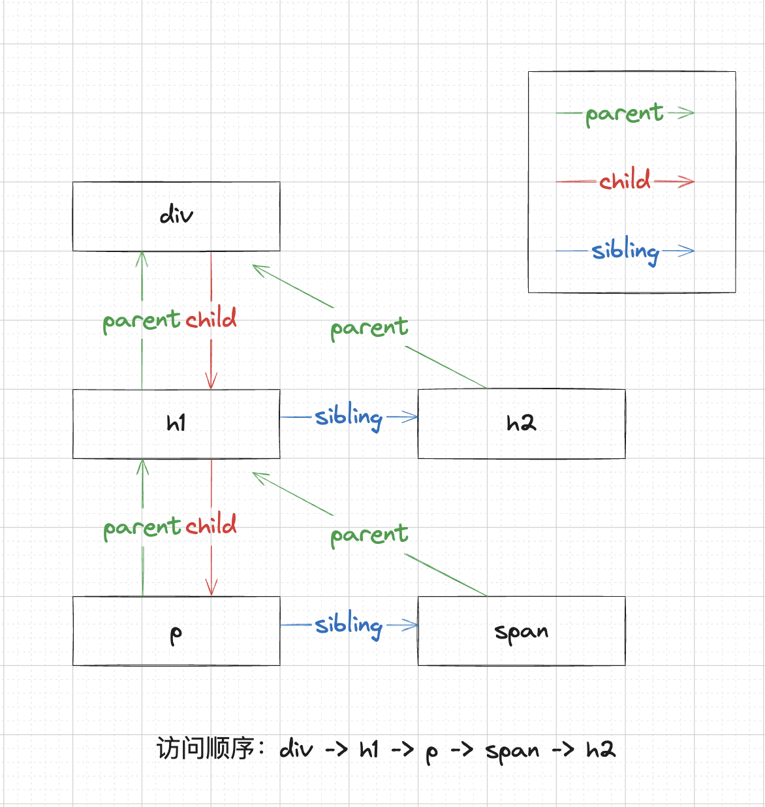

# fiber

上文提到，我们把一个大的任务拆分成了一个个工作单元，但是这个工作单元具体是个什么玩意，其实就是我们这节讲的fiber。

fiber是一种数据结构，如果你对虚拟dom有了解，你可以理解成就是那玩意，不过fiber是通过链表的结构进行组织的。十分方便的**随时中断和恢复**，也就是上节我们提到的任务如何中断和恢复。

所以我们需要为节点创建fiber。

## fiber的规则

我们先来举一个例子，假设我有个如下图的节点要渲染，需要按照怎样的顺序构建

```js
export default function App() {
  return (
    <div>
      <h1>
        <p></p>
        <span></span>
      </h1>
      <h2></h2>
    </div>
  )
}
```



我们只需要记住一个关键即可，**深度优先**，具体的规则

- 1、有child访问child
- 2、无child，有sibling，访问sibling
- 3、无child，无sibling，有uncle，访问uncle (uncle: parent的sibling)

## 改造代码

接下来我们就要开始对render函数进行改造。

1、首先，我们先把创建真实dom的操作抽离出去


::: code-group


```js [React.js (新)]

/**
 * 根据fiber
 * @param {*} fiber
 */
function createDom(fiber) {         // [!code ++]
  //  1、创建dom
  const dom =
    fiber.type === NODE_TYPE.text
      ? document.createTextNode("")
      : document.createElement(fiber.type);

  //  2、处理props
  Object.keys(fiber.props).forEach((key) => {
    if (key !== "children") {
      dom[key] = fiber.props[key];
    }
  });

  return dom;
}

/**
 * 构建根fiber
 * @param {any} node 虚拟节点
 * @param {*} container  真实节点
 */
function render(node, container) {
  nextUnitOfWork = {    // [!code ++]
    dom: container,     // [!code ++]
    props: {            // [!code ++]
      children: [node], // [!code ++]
    },                  // [!code ++]
  };                    // [!code ++]
}

//  即将执行的工作单元 (fiber结构)
let nextUnitOfWork = null;

/**
 * 任务调度
 * @param {IdleDeadline} deadline
 */
function workLoop(deadline) {
  let shouldYield = false;
  while (nextUnitOfWork && !shouldYield) {
    nextUnitOfWork = performUnitOfWork(nextUnitOfWork);
    shouldYield = deadline.timeRemaining() < 1;
  }
  requestIdleCallback(workLoop);
}

requestIdleCallback(workLoop);

/**
 * 执行当前工作单元的工作 (就是一个个的任务)
 * @param {*} fiber
 * @returns
 */
function performUnitOfWork(fiber) {
  // TODO
}

```

```js [React.js (旧)]
/**
 * 渲染函数
 * @param {any} node 虚拟节点
 * @param {*} container  真实节点
 */
function render(node, container) {
  //  1、创建dom
  const dom =
    node.type === NODE_TYPE.text
      ? document.createTextNode("")
      : document.createElement(node.type);

  //  2、处理props
  Object.keys(node.props).forEach((key) => {
    if (key !== "children") {
      dom[key] = node.props[key];
    }
  });

  //  3、处理children
  const children = node.props.children || [];
  children.forEach((child) => {
    render(child, dom);
  });

  //  4、挂载dom
  container.append(dom);
}
```

:::

2、接下来就需要完善performUnitOfWork

首先，我们要明确要做的事情

- 1、创建节点，挂载到父节点上
- 2、按照fiber的遍历规则，将children处理成fiber
- 3、返回下一个要处理的fiber


```js

/**
 * 执行当前工作单元的工作 (就是一个个的任务)
 * @param {*} fiber
 * @returns
 */
function performUnitOfWork(fiber) {
  //*  创建节点，挂载到父节点上
  if (!fiber.dom) {
    const dom = createDom(fiber);
    fiber.dom = dom;
  }

  if (fiber.parent) {
    fiber.parent.dom.appendChild(fiber.dom);
  }
  //*  按照fiber的遍历规则，将children处理成fiber

  const { children = [] } = fiber.props;

  //  为了构建sibling，需要知道记录上一个fiber
  let prevFiber = null;

  children.forEach((node, index) => {
    const newFiber = {
      type: node.type,
      props: node.props,
      parent: fiber,
      dom: null,
    };

    if (index === 0) {
      //  第一个子元素设为child
      fiber.child = newFiber;
    } else {
      //  后续的与前一个构建sibling
      prevFiber.sibling = newFiber;
    }

    prevFiber = newFiber;
  });

  //* 返回下一个要处理的fiber

  //  下面的一段理解成深度优先遍历
  if (fiber.child) {
    return fiber.child;
  }
  let curFiber = fiber;
  while (curFiber) {
    if (curFiber.sibling) {
      return curFiber.sibling;
    }
    curFiber = curFiber.parent;
  }
}
```