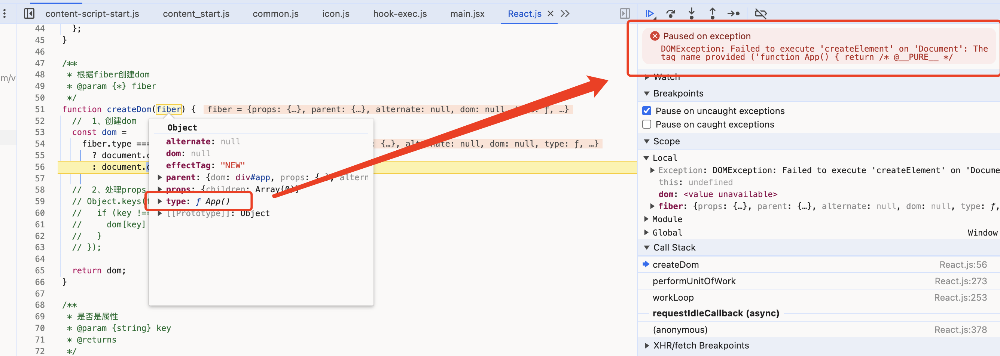

# 函数式组件

不知道你是否有关注到，我们之前渲染的方式是这样的:

:::code-group

```jsx [main.jsx]
import ReactDOM from "@/_core/ReactDom.js";
import App from "./app.jsx";

//  暂时不支持这种方式，因为<App/>返回的是一个函数，暂时没处理
//  ReactDOM.createRoot(document.querySelector("#app")).render(<App></App>);
ReactDOM.createRoot(document.querySelector("#app")).render(App());
```

```jsx [app.jsx]
function App() {
  return (
    <div className="test-cls">
      <p>123</p>
      <div>child</div>
    </div>
  );
}

export default App;


```

:::

如果我们换成渲染 `<App></App>` 的方式去渲染会报什么错，我们一起来看下吧。



## 原因分析

可以看到，是因为换成函数式组件后，`type` 变成了函数类型，导致 `createDom` 报错。我们再往前翻一下调用 `createDom` 的地方再看看。

```js

/**
 * 执行当前工作单元的工作 (就是一个个的任务)
 * @param {*} fiber
 * @returns
 */
function performUnitOfWork(fiber) {
  //*  创建节点，挂载到父节点上
  if (!fiber.dom) { // [!code warning]
    const dom = createDom(fiber); // [!code warning]
    fiber.dom = dom;  // [!code warning]
    updateProps(dom, fiber.props);  // [!code warning]
  } // [!code warning]

  //*  按照fiber的遍历规则，将children处理成fiber
  const { children = [] } = fiber.props;  // [!code warning]
  reconcileChildren(fiber, children); // [!code warning]

  //* 返回下一个要处理的fiber

  //  下面的一段理解成深度优先遍历
  if (fiber.child) {
    return fiber.child;
  }
  let curFiber = fiber;
  while (curFiber) {
    if (curFiber.sibling) {
      return curFiber.sibling;
    }
    curFiber = curFiber.parent;
  }
}
```

可以看到，这里暴露了两个问题：

- 1、如果是函数组组件，不应该直接调用 `createDom`
- 2、函数式组件的 `children` 不来自于 `props`，而是**来自于调用函数组件后返回的结果**。

## 代码改造

`performUnitOfWork` 需要针对 `type` 进行分别处理，这里我们用两个函数去分别处理函数组件和dom。

正如上面问题说到的，函数组件需要把props丢进去运行，把返回的children拿出来执行 `reconcileChildren`


```js
/**
 * 执行当前工作单元的工作 (就是一个个的任务)
 * @param {*} fiber
 * @returns
 */
function performUnitOfWork(fiber) {
  //*  创建节点，挂载到父节点上 // [!code --]
  if (!fiber.dom) { // [!code --]
    const dom = createDom(fiber); // [!code --]
    fiber.dom = dom;  // [!code --]
    updateProps(dom, fiber.props);  // [!code --]
  } // [!code --]
  //*  按照fiber的遍历规则，将children处理成fiber // [!code --]
  const { children = [] } = fiber.props;  // [!code --]
  reconcileChildren(fiber, children); // [!code --]

  //*  判断是不是函数组件 // [!code ++]
  if (typeof fiber.type === "function") { // [!code ++]
    updateFunctionComponent(fiber); // [!code ++]
  } else {  // [!code ++]
    updateHostComponent(fiber); // [!code ++]
  } // [!code ++]

  //* 返回下一个要处理的fiber

  //  下面的一段理解成深度优先遍历
  if (fiber.child) {
    return fiber.child;
  }
  let curFiber = fiber;
  while (curFiber) {
    if (curFiber.sibling) {
      return curFiber.sibling;
    }
    curFiber = curFiber.parent;
  }
}

/**
 * 处理虚拟dom类型的fiber
 * @param {*} fiber 
 */
function updateHostComponent(fiber) { // [!code ++]
  //*  创建节点，挂载到父节点上
  if (!fiber.dom) {
    const dom = createDom(fiber);
    fiber.dom = dom;

    updateProps(dom, fiber.props);
  }

  //*  按照fiber的遍历规则，将children处理成fiber

  const { children = [] } = fiber.props;

  reconcileChildren(fiber, children);
}

/**
 * 处理组件类型的fiber
 * @param {*} fiber 
 */
function updateFunctionComponent(fiber) { // [!code ++]
  const children = [fiber.type(fiber.props)];

  reconcileChildren(fiber, children);
}

```