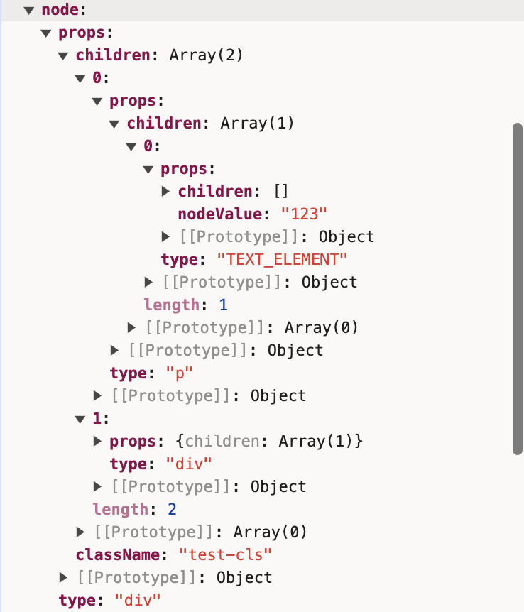
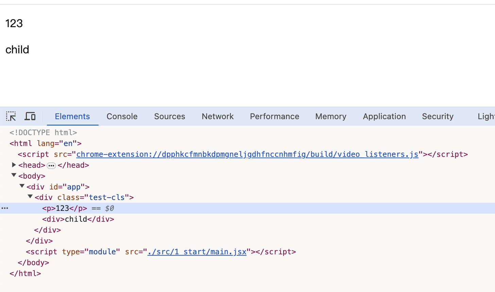

# 开始

一开始的目标，首先是可以渲染jsx，所以我们先去适配jsx。

## jsx

本文借助vite来替代掉babel来解析[jsx](https://cn.vitejs.dev/guide/features.html#jsx)。实际上vite是借助esbuild来解析的，如果对这方面有疑惑的可以看看esbuild的文档。

接下来，我们看看 `jsx` 解析后长什么样。

```js
function App() {
  return (
    <div className="test-cls">
      <p>123</p>
      <div>child</div>
    </div>
  );
}

export default App;

//  通过jsx编译后的结构
const node = {
  type: "",
  props: {
    // ...other props
    children: []
  }
}
```



## 项目配置

首先，vite会自动的给每个jsx声明 `import React from 'react';` 。

我们想要使用自己的 `react` 的话，需要把路径指向自己的 `react.js`。

但是每个jsx都这么处理很麻烦，就交给vite做，他有个设置是可以给每个jsx自动注入helper

```js{11}
import { defineConfig } from "vite";
import path from "node:path";

function _resolve(dir) {
  return path.resolve(__dirname, dir);
}

export default defineConfig({
  test: {},
  esbuild: {
    jsxInject: `import React from '@/_core/React.js'`,
  },
  server: {
    port: 8000,
  },
  resolve: {
    alias: {
      "@": _resolve("src"),
    },
  },
});

```

## 演示代码

```html
<!DOCTYPE html>
<html lang="en">
  <head>
    <meta charset="UTF-8" />
    <link rel="icon" type="image/svg+xml" href="/vite.svg" />
    <meta name="viewport" content="width=device-width, initial-scale=1.0" />
    <title>Vite App</title>
  </head>
  <body>
    <div id="app"></div>
    <script type="module" src="./src/1_start/main.jsx"></script>
  </body>
</html>

```

**main.jsx**
```jsx
import ReactDOM from "@/_core/ReactDom.js";
import App from "./app.jsx";

//  暂时不支持这种方式，因为<App/>返回的是一个函数，暂时没处理
//  ReactDOM.createRoot(document.querySelector("#app")).render(<App></App>);
ReactDOM.createRoot(document.querySelector("#app")).render(App());

```



## 核心代码

::: code-group
```js [React.js]
const NODE_TYPE = {
  text: "TEXT_ELEMENT",
};

/**
 * 创建文本节点的虚拟节点
 * @param {string} text
 * @returns
 */
function createTextNode(text) {
  return {
    type: NODE_TYPE.text,
    props: {
      nodeValue: text,
      children: [],
    },
  };
}

/**
 * 创建节点的虚拟节点
 * @param {any} type
 * @param {any} props
 * @param  {...any} children
 * @returns
 */
function createElement(type, props = {}, ...children) {
  return {
    type,
    props: {
      ...props,
      children: children.map((child) => {
        return typeof child === "string" ? createTextNode(child) : child;
      }),
    },
  };
}

/**
 * 渲染函数
 * @param {any} node 虚拟节点
 * @param {*} container  真实节点
 */
function render(node, container) {
  //  1、创建dom
  const dom =
    node.type === NODE_TYPE.text
      ? document.createTextNode("")
      : document.createElement(node.type);

  //  2、处理props
  Object.keys(node.props).forEach((key) => {
    if (key !== "children") {
      dom[key] = node.props[key];
    }
  });

  //  3、处理children
  const children = node.props.children || [];
  children.forEach((child) => {
    render(child, dom);
  });

  //  4、挂载dom
  container.append(dom);
}

export default {
  render,
  createElement,
};

```
```js [ReactDom.js]
import React from "./React.js";

const ReactDOM = {
  createRoot(container) {
    return {
      render(App) {
        React.render(App, container);
      },
    };
  },
};

export default ReactDOM;

```

:::